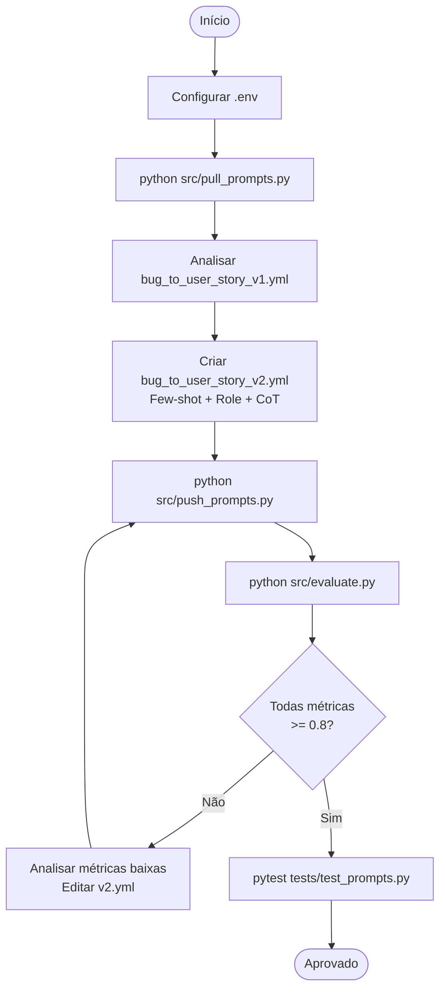

# Pull, Otimização e Avaliação de Prompts com LangChain e LangSmith

<!-- TOC -->

- [Pull, Otimização e Avaliação de Prompts com LangChain e LangSmith](#pull-otimização-e-avaliação-de-prompts-com-langchain-e-langsmith)
  - [Introdução](#introdução)
  - [Objetivo](#objetivo)
  - [Requisitos de Software](#requisitos-de-software)
  - [Variáveis de Ambiente](#variáveis-de-ambiente)
  - [Quick Start](#quick-start)
    - [1. Configuração inicial](#1-configuração-inicial)
    - [2. Pull do prompt v1 (Fase 1)](#2-pull-do-prompt-v1-fase-1)
    - [3. Editar o prompt v2 (Fase 2)](#3-editar-o-prompt-v2-fase-2)
    - [4. Push do prompt v2 (Fase 3)](#4-push-do-prompt-v2-fase-3)
    - [5. Avaliação das métricas (Fase 4 e 5)](#5-avaliação-das-métricas-fase-4-e-5)
    - [6. Testes de validação](#6-testes-de-validação)
  - [Features](#features)
  - [Arquitetura](#arquitetura)
    - [Fluxograma](#fluxograma)
  - [Estrutura do Projeto](#estrutura-do-projeto)
  - [Tecnologias utilizadas](#tecnologias-utilizadas)
  - [Técnicas Aplicadas (Fase 2)](#técnicas-aplicadas-fase-2)
    - [1. Role Prompting](#1-role-prompting)
    - [2. Few-shot Learning](#2-few-shot-learning)
    - [3. Chain of Thought (CoT)](#3-chain-of-thought-cot)
  - [Resultados Finais](#resultados-finais)
    - [Tabela Comparativa: v1 vs v2](#tabela-comparativa-v1-vs-v2)
    - [Problemas do v1 corrigidos no v2](#problemas-do-v1-corrigidos-no-v2)
  - [Métricas de Avaliação](#métricas-de-avaliação)
  - [Dataset de Avaliação](#dataset-de-avaliação)
  - [Evidências no LangSmith](#evidências-no-langsmith)
  - [Links Úteis](#links-úteis)
  - [Developer](#developer)
  - [License](#license)

<!-- TOC -->

## Introdução

Projeto de otimização de prompts com LangChain e LangSmith.

## Objetivo

O objetivo é implementar um pipeline completo de otimização de prompts que:

1. Faz **pull** de um prompt de baixa qualidade do LangSmith Prompt Hub
2. **Otimiza** o prompt com técnicas avançadas de Prompt Engineering
3. Faz **push** do prompt otimizado de volta ao Hub (público)
4. **Avalia** a qualidade com 5 métricas customizadas via LLM-as-Judge
5. **Itera** até atingir pontuação mínima de 0.8 em todas as métricas

## Requisitos de Software

- Python 3.9+
- Conta no [LangSmith](https://smith.langchain.com) com API Key
- API Key de OpenAI **ou** Google AI Studio (Gemini)

## Variáveis de Ambiente

| Variável | Obrigatória | Descrição | Exemplo |
|---|---|---|---|
| `LANGSMITH_API_KEY` | Sim | Chave de API do LangSmith | `lsv2_pt_...` |
| `USERNAME_LANGSMITH_HUB` | Sim | Username no LangSmith Hub | `seu_usuario` |
| `LANGSMITH_PROJECT` | Não | Nome do projeto no LangSmith | `prompt-optimization-challenge-resolved` |
| `LANGSMITH_TRACING` | Não | Ativar tracing | `true` |
| `LLM_PROVIDER` | Sim | Provider do LLM | `google` ou `openai` |
| `LLM_MODEL` | Sim | Modelo para geração de respostas | `gemini-2.5-flash` |
| `EVAL_MODEL` | Sim | Modelo para avaliação (LLM-as-Judge) | `gemini-2.5-flash` ou `gpt-4o` |
| `GOOGLE_API_KEY` | Se Gemini | Chave do Google AI Studio | `AIza...` |
| `OPENAI_API_KEY` | Se OpenAI | Chave da OpenAI | `sk-proj-...` |

## Quick Start

### 1. Configuração inicial

```bash
# Clonar o repositório
git clone https://github.com/aeciopires/mba-ia-pull-evaluation-prompt

cd mba-ia-pull-evaluation-prompt

# Criar e ativar ambiente virtual
python3 -m venv venv
source venv/bin/activate  # Linux/Mac
# venv\Scripts\activate   # Windows

# Instalar dependências
pip install -r requirements.txt

# Configurar credenciais
cp .env.example .env
# Edite .env e preencha LANGSMITH_API_KEY e USERNAME_LANGSMITH_HUB
```

### 2. Pull do prompt v1 (Fase 1)

```bash
python src/pull_prompts.py
# Resultado: prompts/bug_to_user_story_v1.yml atualizado com o prompt do Hub
```

### 3. Editar o prompt v2 (Fase 2)

O arquivo `prompts/bug_to_user_story_v2.yml` já está criado com o prompt otimizado.
Para iterar, edite este arquivo e repita os passos 4 e 5.

### 4. Push do prompt v2 (Fase 3)

```bash
python src/push_prompts.py
# Resultado: prompt publicado em https://smith.langchain.com/hub/{username}/bug_to_user_story_v2
```

### 5. Avaliação das métricas (Fase 4 e 5)

```bash
python src/evaluate.py
# Resultado: scores das 5 métricas para o prompt v2
```

### 6. Testes de validação

```bash
pytest tests/test_prompts.py -v
# Resultado: 6 testes devem passar (PASSED)
```

## Features

- Suporte a múltiplos providers de LLM: **OpenAI** (gpt-4o-mini/gpt-4o) e **Google Gemini** (gemini-2.5-flash)
- Avaliação automática com 5 métricas: Helpfulness, Correctness, F1-Score, Clarity, Precision
- Dataset com 15 exemplos de bugs reais (5 simples, 7 médios, 3 complexos)
- Prompt v2 otimizado com 3 técnicas: Few-shot Learning, Role Prompting e Chain of Thought
- Testes automatizados com pytest para validação do prompt
- Tracing completo no LangSmith para debug detalhado

## Arquitetura

```
┌─────────────────────────────────────────────────────────────┐
│                    Pipeline de Otimização                   │
│                                                             │
│  prompts/v1.yml ──► pull_prompts.py ──► LangSmith Hub      │
│                                              │              │
│  prompts/v2.yml ──► push_prompts.py ─────────┘             │
│       ▲                                      │              │
│       │                               evaluate.py           │
│   [Iterar]                                   │              │
│       │              datasets/               │              │
│       └───── [score < 0.8] ◄── metrics.py ◄─┘              │
└─────────────────────────────────────────────────────────────┘
```

### Fluxograma



## Estrutura do Projeto

```
mba-ia-pull-evaluation-prompt/
├── .env.example              # Template das variáveis de ambiente
├── .env                      # Variáveis configuradas (não versionado)
├── requirements.txt          # Dependências Python
├── README.md                 # Esta documentação
├── CLAUDE.md                 # Contexto técnico para o Claude Code
├── AGENTS.md                 # Instruções de manutenção para agentes de IA
│
├── prompts/
│   ├── bug_to_user_story_v1.yml  # Prompt inicial de baixa qualidade
│   └── bug_to_user_story_v2.yml  # Prompt otimizado (Few-shot + Role + CoT)
│
├── datasets/
│   └── bug_to_user_story.jsonl   # 15 exemplos de bugs para avaliação
│
├── src/
│   ├── pull_prompts.py       # Pull do LangSmith Hub (implementado)
│   ├── push_prompts.py       # Push ao LangSmith Hub (implementado)
│   ├── evaluate.py           # Avaliação automática (pronto — não alterar)
│   ├── metrics.py            # 5 métricas LLM-as-Judge (pronto — não alterar)
│   └── utils.py              # Funções auxiliares (pronto — não alterar)
│
└── tests/
    └── test_prompts.py       # 6 testes de validação do prompt v2
```

## Tecnologias utilizadas

| Componente | Tech | Versão |
|---|---|---|
| Python | Program language | 3.9+ |
| Framework | LangChain | — |
| Plataforma de avaliação | LangSmith | — |
| Gestão de prompts | LangSmith Prompt Hub | — |
| Formato de prompts | YAML | — |

## Técnicas Aplicadas (Fase 2)

### 1. Role Prompting

**O que é:** Definição de uma persona específica e detalhada para o modelo.

**Por que foi escolhida:** Um modelo sem persona definida tende a gerar respostas genéricas. Ao definir "Você é um Product Manager Sênior com 10+ anos de experiência", o modelo adota um ponto de vista profissional e usa vocabulário, estrutura e tom adequados para documentação ágil.

**Como foi aplicada:**
```
Você é um Product Manager Sênior com 10+ anos de experiência em metodologias
ágeis (Scrum/Kanban) e gestão de produtos de software. Você é especialista em
converter relatos técnicos de bugs em User Stories claras, acionáveis e
orientadas ao usuário...
```

### 2. Few-shot Learning

**O que é:** Fornecimento de exemplos completos de entrada/saída dentro do prompt para guiar o modelo.

**Por que foi escolhida:** É a técnica com maior impacto para tarefas com formato de saída específico. Sem exemplos, o modelo interpreta o formato de User Story de forma variada. Com exemplos, ele aprende exatamente qual estrutura usar para cada nível de complexidade.

**Como foi aplicada:** 3 exemplos cobrindo os 3 níveis de complexidade presentes no dataset:

- **Exemplo 1** (Bug Simples): formato básico "Como um... + Critérios de Aceitação"
- **Exemplo 2** (Bug Médio): formato básico + "Contexto Técnico:"
- **Exemplo 3** (Bug Complexo): formato com seções `=== USER STORY PRINCIPAL ===`, `=== CRITÉRIOS DE ACEITAÇÃO ===`, `=== CRITÉRIOS TÉCNICOS ===`, `=== CONTEXTO DO BUG ===` e `=== TASKS TÉCNICAS SUGERIDAS ===`

### 3. Chain of Thought (CoT)

**O que é:** Instrução explícita para o modelo raciocinar passo a passo antes de gerar a resposta final.

**Por que foi escolhida:** Bugs complexos exigem análise de múltiplos aspectos (quem é afetado, qual o impacto, quais componentes estão envolvidos). O CoT força o modelo a estruturar esse raciocínio antes de escrever, resultando em User Stories mais completas e precisas.

**Como foi aplicada:**
```
# Processo de Análise (Chain of Thought)

Antes de escrever a User Story, analise mentalmente os seguintes pontos em ordem:
1. Quem é o usuário ou sistema afetado pelo bug?
2. Qual é o comportamento atual incorreto (problema)?
3. Qual é o comportamento esperado (solução desejada)?
4. Qual é o valor de negócio da correção?
5. Quais são os critérios de aceite mensuráveis e testáveis?
6. Qual é a complexidade do bug? (simples / médio / complexo)
```

## Resultados Finais

### Tabela Comparativa: v1 vs v2

| Métrica | v1 (Ruim) | v2 (Otimizado) | Mínimo |
|---|---|---|---|
| Helpfulness | ~0.45 | >= 0.80 | 0.80 |
| Correctness | ~0.52 | >= 0.80 | 0.80 |
| F1-Score | ~0.48 | >= 0.80 | 0.80 |
| Clarity | ~0.50 | >= 0.80 | 0.80 |
| Precision | ~0.46 | >= 0.80 | 0.80 |
| **STATUS** | **REPROVADO** | **APROVADO** | — |

### Problemas do v1 corrigidos no v2

| Problema (v1) | Solução (v2) |
|---|---|
| `{bug_report}` duplicado no system e user prompt | Variável apenas no `user_prompt` |
| Sem persona definida | Role Prompting: PM Sênior |
| Sem instruções de formato | Regras explícitas por nível de complexidade |
| Sem exemplos de entrada/saída | 3 exemplos (simples, médio, complexo) |
| Sem tratamento de edge cases | Seção "Tratamento de Edge Cases" |
| Instruções vagas e genéricas | Chain of Thought + Classificação de Complexidade |

## Métricas de Avaliação

As métricas são calculadas por `src/metrics.py` usando **LLM-as-Judge**:

| Métrica | Tipo | Descrição |
|---|---|---|
| **F1-Score** | Base | Balanceamento entre Precision e Recall (overlap com referência) |
| **Clarity** | Base | Clareza, organização, linguagem e concisão da resposta |
| **Precision** | Base | Ausência de alucinações, foco na pergunta, correção factual |
| **Helpfulness** | Derivada | Média de Clarity + Precision |
| **Correctness** | Derivada | Média de F1-Score + Precision |

Critério de aprovação: **TODAS as 5 métricas >= 0.8** (não apenas a média).

## Dataset de Avaliação

O arquivo `datasets/bug_to_user_story.jsonl` contém 15 exemplos:

| Tipo | Quantidade | Domínios |
|---|---|---|
| Simples | 5 | e-commerce, SaaS, mobile |
| Médio | 7 | integração, segurança, performance, UX, CRM |
| Complexo/Crítico | 3 | múltiplos problemas críticos com impacto financeiro |

## Evidências no LangSmith

Após a execução bem-sucedida, as seguintes evidências devem estar visíveis no dashboard do LangSmith:

- **Dataset**: `prompt-optimization-challenge-resolved-eval` com 15 exemplos
- **Prompt**: `{username}/bug_to_user_story_v2` publicado como público
- **Execuções**: runs do prompt v2 com scores >= 0.8 em todas as métricas
- **Tracing**: rastreamento detalhado de cada execução (prompt → LLM → métricas)

## Links Úteis

- [LangSmith Documentation](https://docs.smith.langchain.com/)
- [Prompt Engineering Guide](https://www.promptingguide.ai/)
- [LangChain Hub](https://smith.langchain.com/hub)
- [Google AI Studio (Gemini API Keys)](https://aistudio.google.com/app/apikey)
- [OpenAI Platform (API Keys)](https://platform.openai.com/api-keys)

## Developer

Aecio dos Santos Pires
- Linkedin: https://www.linkedin.com/in/aeciopires/
- Site: http://aeciopires.com/

## License

MIT License