# Pull, Otimização e Avaliação de Prompts com LangChain e LangSmith

<!-- TOC -->

- [Pull, Otimização e Avaliação de Prompts com LangChain e LangSmith](#pull-otimização-e-avaliação-de-prompts-com-langchain-e-langsmith)
  - [Introdução](#introdução)
  - [Objetivo](#objetivo)
  - [Requisitos de Software](#requisitos-de-software)
  - [Variáveis de Ambiente](#variáveis-de-ambiente)
  - [Configuração de API Keys](#configuração-de-api-keys)
  - [Como executar?](#como-executar)
    - [1. Configuração inicial](#1-configuração-inicial)
    - [1.1 Validação do ambiente](#11-validação-do-ambiente)
    - [2. Pull do prompt v1 (Fase 1)](#2-pull-do-prompt-v1-fase-1)
    - [3. Editar o prompt v2 (Fase 2)](#3-editar-o-prompt-v2-fase-2)
    - [4. Push do prompt v2 (Fase 3)](#4-push-do-prompt-v2-fase-3)
    - [5. Avaliação das métricas (Fase 4 e 5)](#5-avaliação-das-métricas-fase-4-e-5)
    - [6. Testes de validação](#6-testes-de-validação)
  - [Troubleshooting](#troubleshooting)
    - [Erro 429 — Quota Gemini esgotada](#erro-429--quota-gemini-esgotada)
    - [Erro 429 — Quota OpenAI esgotada (`insufficient_quota`)](#erro-429--quota-openai-esgotada-insufficient_quota)
    - [Erro — Prompt não encontrado no Hub](#erro--prompt-não-encontrado-no-hub)
    - [Erro — Variáveis de ambiente faltando](#erro--variáveis-de-ambiente-faltando)
    - [Erro — `ModuleNotFoundError` ao executar scripts](#erro--modulenotfounderror-ao-executar-scripts)
    - [Métricas abaixo de 0.8 após avaliação](#métricas-abaixo-de-08-após-avaliação)
    - [FutureWarning do pacote google-generativeai](#futurewarning-do-pacote-google-generativeai)
  - [Features](#features)
  - [Arquitetura](#arquitetura)
    - [Fluxograma](#fluxograma)
  - [Estrutura do Projeto](#estrutura-do-projeto)
  - [Tecnologias utilizadas](#tecnologias-utilizadas)
  - [Técnicas Aplicadas (Fase 2)](#técnicas-aplicadas-fase-2)
    - [1. Role Prompting](#1-role-prompting)
    - [2. Few-shot Learning](#2-few-shot-learning)
    - [3. Chain of Thought (CoT)](#3-chain-of-thought-cot)
  - [Resultados Finais](#resultados-finais)
    - [Evidências no LangSmith](#evidências-no-langsmith)
    - [Dataset de Avaliação](#dataset-de-avaliação)
    - [Problemas do v1 corrigidos no v2](#problemas-do-v1-corrigidos-no-v2)
    - [Métricas de Avaliação](#métricas-de-avaliação)
    - [Screenshots](#screenshots)
    - [Resultados de uma execução dos scripts](#resultados-de-uma-execução-dos-scripts)
    - [Tabela Comparativa: v1 vs v2](#tabela-comparativa-v1-vs-v2)
    - [Scores por exemplo](#scores-por-exemplo)
  - [Links Úteis](#links-úteis)
  - [Developer](#developer)
  - [License](#license)

<!-- TOC -->

## Introdução

Projeto de otimização de prompts com LangChain e LangSmith.

## Objetivo

O objetivo é implementar um pipeline completo de otimização de prompts que:

1. Faz **pull** de um prompt de baixa qualidade do LangSmith Prompt Hub
2. **Otimiza** o prompt com técnicas avançadas de Prompt Engineering
3. Faz **push** do prompt otimizado de volta ao Hub (público)
4. **Avalia** a qualidade com 5 métricas customizadas via LLM-as-Judge
5. **Itera** até atingir pontuação mínima de 0.8 em todas as métricas

## Requisitos de Software

| Software | Versão mínima | Descrição | Link |
|---|---|---|---|
| Python | 3.9+ | Linguagem de programação principal | [python.org](https://www.python.org/downloads/) |
| pip | 21.0+ | Gerenciador de pacotes Python (incluso no Python 3.9+) | — |
| Git | 2.30+ | Controle de versão | [git-scm.com](https://git-scm.com/) |
| Conta LangSmith | — | Plataforma de avaliação e gestão de prompts (gratuita) | [smith.langchain.com](https://smith.langchain.com) |
| LangSmith API Key | — | Necessária para pull/push de prompts e avaliação | [Gerar aqui](https://smith.langchain.com/settings) |
| OpenAI API Key **ou** Google AI Studio API Key | — | Pelo menos um provider de LLM com créditos disponíveis | [OpenAI](https://platform.openai.com/api-keys) / [Google AI Studio](https://aistudio.google.com/app/apikey) |

## Variáveis de Ambiente

| Variável | Obrigatória | Descrição | Exemplo |
|---|---|---|---|
| `LANGSMITH_API_KEY` | Sim | Chave de API do LangSmith | `lsv2_pt_...` |
| `USERNAME_LANGSMITH_HUB` | Sim | Username no LangSmith Hub | `seu_usuario` |
| `LANGSMITH_PROJECT` | Não | Nome do projeto no LangSmith | `prompt-optimization-challenge-resolved` |
| `LANGSMITH_TRACING` | Não | Ativar tracing | `true` |
| `LLM_PROVIDER` | Sim | Provider do LLM | `google` ou `openai` |
| `LLM_MODEL` | Sim | Modelo para geração de respostas | `gemini-2.5-flash` |
| `EVAL_MODEL` | Sim | Modelo para avaliação (LLM-as-Judge) | `gemini-2.5-flash` ou `gpt-4o` |
| `GOOGLE_API_KEY` | Se Gemini | Chave do Google AI Studio | `AIza...` |
| `OPENAI_API_KEY` | Se OpenAI | Chave da OpenAI | `sk-proj-...` |

## Configuração de API Keys

Configure as credenciais nos arquivos `openai.yaml` e `gemini.yaml`, ou nas variáveis de ambiente `OPENAI_API_KEY` / `GOOGLE_API_KEY`.

**Opção 1**: Arquivos de configuração `openai.yaml` e `gemini.yaml`

Exemplo do arquivo `openai.yaml`

```yaml
site: "https://platform.openai.com/settings/organization/api-keys"
id: "key_..."
secret: "sk-proj-..."
```

Exemplo do arquivo `gemini.yaml`:

```yaml
site: "https://aistudio.google.com/api-keys"
nome: "Gemini API"
projeto: "1234567890"
secret: "AQ.Ab8R..."
```

**Opção 2**: Variáveis de Ambiente

```bash
export OPENAI_API_KEY=sk-proj-...
export GOOGLE_API_KEY=AQ.Ab8R...
```

## Como executar?

### 1. Configuração inicial

```bash
# Clonar o repositório
git clone https://github.com/aeciopires/mba-ia-pull-evaluation-prompt

cd mba-ia-pull-evaluation-prompt

# Criar e ativar ambiente virtual
python3 -m venv venv
source venv/bin/activate  # Linux/Mac
# venv\Scripts\activate   # Windows

# Instalar dependências
pip install -r requirements.txt

# Configurar credenciais
cp .env.example .env
# Edite .env e preencha LANGSMITH_API_KEY e USERNAME_LANGSMITH_HUB
```

### 1.1 Validação do ambiente

Após instalar as dependências e preencher o `.env`, execute a validação completa para confirmar que tudo está configurado corretamente:

```bash
# Validação completa (inclui teste de conectividade com LangSmith)
python src/validate.py

# Validação rápida sem chamadas de rede
python src/validate.py --no-api
```

O script verifica 7 categorias em sequência e exibe um resumo final:

| # | Verificação | O que checa |
|---|---|---|
| 1 | Versão do Python | >= 3.9 |
| 2 | Pacotes instalados | Todos os itens do `requirements.txt` |
| 3 | Variáveis de ambiente | `.env` existe, campos obrigatórios preenchidos, provider correto |
| 4 | Arquivos do projeto | Prompts, dataset, scripts `src/` e testes existem |
| 5 | Estrutura do prompt v2 | Campos obrigatórios, `{bug_report}`, técnicas, exemplos few-shot |
| 6 | Dataset JSONL | 15 exemplos com `inputs.bug_report` e `outputs.reference` |
| 7 | Conectividade LangSmith | Conexão com a API e presença do prompt no Hub |

**Saída esperada quando tudo está OK:**
```
✅ STATUS: AMBIENTE OK — todos os requisitos estão satisfeitos.
```

**Saída quando há problemas:**
```
❌ Erros encontrados (2):
   • LANGSMITH_API_KEY não configurada no .env
   • Prompt 'usuario/bug_to_user_story_v2' não encontrado no Hub

🔴 STATUS: AMBIENTE COM PROBLEMAS — corrija os erros acima antes de prosseguir.
```

### 2. Pull do prompt v1 (Fase 1)

```bash
python src/pull_prompts.py
# Resultado: prompts/bug_to_user_story_v1.yml atualizado com o prompt do Hub
```

### 3. Editar o prompt v2 (Fase 2)

O arquivo `prompts/bug_to_user_story_v2.yml` já está criado com o prompt otimizado.
Para iterar, edite este arquivo e repita os passos 4 e 5.

### 4. Push do prompt v2 (Fase 3)

```bash
python src/push_prompts.py
# Resultado: prompt publicado em https://smith.langchain.com/hub/{username}/bug_to_user_story_v2
```

### 5. Avaliação das métricas (Fase 4 e 5)

```bash
python src/evaluate.py
# Resultado: scores das 5 métricas para o prompt v2
```

### 6. Testes de validação

```bash
pytest tests/test_prompts.py -v
# Resultado: 6 testes devem passar (PASSED)
```

## Troubleshooting

### Erro 429 — Quota Gemini esgotada

**Sintoma:**
```
ResourceExhausted: 429 You exceeded your current quota
quota_metric: "generativelanguage.googleapis.com/generate_content_free_tier_requests"
```

**Causa:** A chave do Google AI Studio está no free tier (limite de ~20 req/dia e 5 req/min). A avaliação exige ~60 chamadas por execução.

**Soluções:**
1. Aguarde o reset diário da quota (renova à meia-noite UTC) e reexecute `python src/evaluate.py`
2. Habilite billing no Google Cloud e gere uma nova `GOOGLE_API_KEY` com limites maiores
3. Alterne para OpenAI no `.env`:
   ```
   LLM_PROVIDER=openai
   LLM_MODEL=gpt-4o-mini
   EVAL_MODEL=gpt-4o
   ```

---

### Erro 429 — Quota OpenAI esgotada (`insufficient_quota`)

**Sintoma:**
```
openai.RateLimitError: Error code: 429 - insufficient_quota
```

**Causa:** A conta OpenAI não possui créditos ou o limite de uso foi atingido.

**Soluções:**
1. Acesse [platform.openai.com/settings/billing](https://platform.openai.com/settings/billing) e adicione créditos
2. Alterne para Gemini no `.env`:
   ```
   LLM_PROVIDER=google
   LLM_MODEL=gemini-2.5-flash
   EVAL_MODEL=gemini-2.5-flash
   ```

---

### Erro — Prompt não encontrado no Hub

**Sintoma:**
```
❌ ERRO: Não foi possível carregar o prompt '{username}/bug_to_user_story_v2'
⚠️  O prompt não foi encontrado no LangSmith Hub.
```

**Causa:** O push ainda não foi executado ou o `USERNAME_LANGSMITH_HUB` está incorreto.

**Solução:**
```bash
# Verificar username configurado
grep USERNAME_LANGSMITH_HUB .env

# Fazer push do prompt
python src/push_prompts.py

# Então avaliar
python src/evaluate.py
```

---

### Erro — Variáveis de ambiente faltando

**Sintoma:**
```
❌ Variáveis de ambiente faltando:
   - LANGSMITH_API_KEY
```

**Causa:** O arquivo `.env` não foi criado ou a variável está vazia.

**Solução:**
```bash
cp .env.example .env
# Edite .env e preencha os valores obrigatórios
```

---

### Erro — `ModuleNotFoundError` ao executar scripts

**Sintoma:**
```
ModuleNotFoundError: No module named 'langchain'
```

**Causa:** O ambiente virtual não está ativo ou as dependências não foram instaladas.

**Solução:**
```bash
python3 -m venv venv
source venv/bin/activate   # Linux/Mac
# venv\Scripts\activate    # Windows
pip install -r requirements.txt
```

---

### Métricas abaixo de 0.8 após avaliação

**Diagnóstico por métrica:**

| Métrica baixa | Causa provável | Ação |
|---|---|---|
| **F1-Score** | Termos-chave ausentes na resposta vs referência | Incluir "Critérios de Aceitação:", "Dado que", "Quando", "Então" no prompt |
| **Clarity** | Resposta sem estrutura clara | Reforçar uso de headers Markdown e seções obrigatórias |
| **Precision** | Informações inventadas ou fuga do tópico | Instruir o modelo a não inventar detalhes não mencionados no bug |
| **Helpfulness** | Resposta pouco útil ao desenvolvedor | Reforçar a persona de PM e o objetivo de gerar user stories acionáveis |
| **Correctness** | Conteúdo incorreto ou impreciso | Adicionar mais exemplos few-shot com respostas de referência |

**Ciclo de melhoria:**
```bash
# 1. Edite o prompt
vim prompts/bug_to_user_story_v2.yml

# 2. Publique a nova versão
python src/push_prompts.py

# 3. Reavalie
python src/evaluate.py
```

---

### FutureWarning do pacote google-generativeai

**Sintoma:**
```
FutureWarning: All support for the `google.generativeai` package has ended.
```

**Causa:** Versão do `langchain-google-genai` instalada ainda usa a biblioteca legada internamente.

**Impacto:** Apenas um aviso informativo — o código continua funcionando normalmente. Nenhuma ação necessária para o desafio.

---

## Features

- Suporte a múltiplos providers de LLM: **OpenAI** (gpt-4o-mini/gpt-4o) e **Google Gemini** (gemini-2.5-flash)
- Avaliação automática com 5 métricas: Helpfulness, Correctness, F1-Score, Clarity, Precision
- Dataset com 15 exemplos de bugs reais (5 simples, 7 médios, 3 complexos)
- Prompt v2 otimizado com 3 técnicas: Few-shot Learning, Role Prompting e Chain of Thought
- Testes automatizados com pytest para validação do prompt
- Tracing completo no LangSmith para debug detalhado

## Arquitetura

```
┌─────────────────────────────────────────────────────────────┐
│                    Pipeline de Otimização                   │
│                                                             │
│  prompts/v1.yml ──► pull_prompts.py ──► LangSmith Hub      │
│                                              │              │
│  prompts/v2.yml ──► push_prompts.py ─────────┘             │
│       ▲                                      │              │
│       │                               evaluate.py           │
│   [Iterar]                                   │              │
│       │              datasets/               │              │
│       └───── [score < 0.8] ◄── metrics.py ◄─┘              │
└─────────────────────────────────────────────────────────────┘
```

### Fluxograma


## Estrutura do Projeto

```
mba-ia-pull-evaluation-prompt/
├── .env.example              # Template das variáveis de ambiente
├── .env                      # Variáveis configuradas (não versionado)
├── requirements.txt          # Dependências Python
├── README.md                 # Esta documentação
├── CLAUDE.md                 # Contexto técnico para o Claude Code
├── AGENTS.md                 # Instruções de manutenção para agentes de IA
│
├── prompts/
│   ├── bug_to_user_story_v1.yml  # Prompt inicial de baixa qualidade
│   └── bug_to_user_story_v2.yml  # Prompt otimizado (Few-shot + Role + CoT)
│
├── datasets/
│   └── bug_to_user_story.jsonl   # 15 exemplos de bugs para avaliação
│
├── src/
│   ├── validate.py           # Validação completa do ambiente e configuração
│   ├── pull_prompts.py       # Pull do LangSmith Hub (implementado)
│   ├── push_prompts.py       # Push ao LangSmith Hub (implementado)
│   ├── evaluate.py           # Avaliação automática (pronto — não alterar)
│   ├── metrics.py            # 5 métricas LLM-as-Judge (pronto — não alterar)
│   └── utils.py              # Funções auxiliares (pronto — não alterar)
│
└── tests/
    └── test_prompts.py       # 6 testes de validação do prompt v2
```

## Tecnologias utilizadas

| Componente | Tecnologia | Versão |
|---|---|---|
| Linguagem de programação | Python | 3.9+ |
| Framework principal | LangChain | 0.3.13 |
| Framework core | LangChain Core | 0.3.28 |
| Comunidade LangChain | LangChain Community | 0.3.13 |
| Plataforma de avaliação e tracing | LangSmith | 0.2.7 |
| Gestão de prompts | LangSmith Prompt Hub | — |
| Provider LLM (geração) | LangChain OpenAI | 0.2.14 |
| Provider LLM (geração alternativa) | LangChain Google GenAI | 2.0.8 |
| Modelo de geração (OpenAI) | GPT-4o Mini | — |
| Modelo de avaliação (OpenAI) | GPT-4o | — |
| Modelo de geração (Gemini) | Gemini 2.5 Flash | — |
| Modelo de avaliação (Gemini) | Gemini 2.5 Flash | — |
| Formato de prompts | YAML | — |
| Carregamento de variáveis | python-dotenv | 1.0.1 |
| Validação de dados | Pydantic | 2.10.4 |
| Parser YAML | PyYAML | 6.0.2 |
| Framework de testes | pytest | 8.3.4 |

## Técnicas Aplicadas (Fase 2)

### 1. Role Prompting

**O que é:** Definição de uma persona específica e detalhada para o modelo.

**Por que foi escolhida:** Um modelo sem persona definida tende a gerar respostas genéricas. Ao definir "Você é um Product Manager Sênior com 10+ anos de experiência", o modelo adota um ponto de vista profissional e usa vocabulário, estrutura e tom adequados para documentação ágil.

**Como foi aplicada:**
```
Você é um Product Manager Sênior com 10+ anos de experiência em metodologias
ágeis (Scrum/Kanban) e gestão de produtos de software. Você é especialista em
converter relatos técnicos de bugs em User Stories claras, acionáveis e
orientadas ao usuário...
```

### 2. Few-shot Learning

**O que é:** Fornecimento de exemplos completos de entrada/saída dentro do prompt para guiar o modelo.

**Por que foi escolhida:** É a técnica com maior impacto para tarefas com formato de saída específico. Sem exemplos, o modelo interpreta o formato de User Story de forma variada. Com exemplos, ele aprende exatamente qual estrutura usar para cada nível de complexidade.

**Como foi aplicada:** 3 exemplos cobrindo os 3 níveis de complexidade presentes no dataset:

- **Exemplo 1** (Bug Simples): formato básico "Como um... + Critérios de Aceitação"
- **Exemplo 2** (Bug Médio): formato básico + "Contexto Técnico:"
- **Exemplo 3** (Bug Complexo): formato com seções `=== USER STORY PRINCIPAL ===`, `=== CRITÉRIOS DE ACEITAÇÃO ===`, `=== CRITÉRIOS TÉCNICOS ===`, `=== CONTEXTO DO BUG ===` e `=== TASKS TÉCNICAS SUGERIDAS ===`

### 3. Chain of Thought (CoT)

**O que é:** Instrução explícita para o modelo raciocinar passo a passo antes de gerar a resposta final.

**Por que foi escolhida:** Bugs complexos exigem análise de múltiplos aspectos (quem é afetado, qual o impacto, quais componentes estão envolvidos). O CoT força o modelo a estruturar esse raciocínio antes de escrever, resultando em User Stories mais completas e precisas.

**Como foi aplicada:**
```
# Processo de Análise (Chain of Thought)

Antes de escrever a User Story, analise mentalmente os seguintes pontos em ordem:
1. Quem é o usuário ou sistema afetado pelo bug?
2. Qual é o comportamento atual incorreto (problema)?
3. Qual é o comportamento esperado (solução desejada)?
4. Qual é o valor de negócio da correção?
5. Quais são os critérios de aceite mensuráveis e testáveis?
6. Qual é a complexidade do bug? (simples / médio / complexo)
```

## Resultados Finais

### Evidências no LangSmith

Link público do dashboard: https://smith.langchain.com/hub/aeciopires/bug_to_user_story_v2

### Dataset de Avaliação

O arquivo `datasets/bug_to_user_story.jsonl` contém 15 exemplos:

| Tipo | Quantidade | Domínios |
|---|---|---|
| Simples | 5 | e-commerce, SaaS, mobile |
| Médio | 7 | integração, segurança, performance, UX, CRM |
| Complexo/Crítico | 3 | múltiplos problemas críticos com impacto financeiro |

### Problemas do v1 corrigidos no v2

| Problema (v1) | Solução (v2) |
|---|---|
| `{bug_report}` duplicado no system e user prompt | Variável apenas no `user_prompt` |
| Sem persona definida | Role Prompting: PM Sênior |
| Sem instruções de formato | Regras explícitas por nível de complexidade |
| Sem exemplos de entrada/saída | 3 exemplos (simples, médio, complexo) |
| Sem tratamento de edge cases | Seção "Tratamento de Edge Cases" |
| Instruções vagas e genéricas | Chain of Thought + Classificação de Complexidade |

### Métricas de Avaliação

As métricas são calculadas por `src/metrics.py` usando **LLM-as-Judge**:

| Métrica | Tipo | Descrição |
|---|---|---|
| **F1-Score** | Base | Balanceamento entre Precision e Recall (overlap com referência) |
| **Clarity** | Base | Clareza, organização, linguagem e concisão da resposta |
| **Precision** | Base | Ausência de alucinações, foco na pergunta, correção factual |
| **Helpfulness** | Derivada | Média de Clarity + Precision |
| **Correctness** | Derivada | Média de F1-Score + Precision |

Critério de aprovação: **TODAS as 5 métricas >= 0.8** (não apenas a média).

### Screenshots

#### Dataset de Avaliação no LangSmith

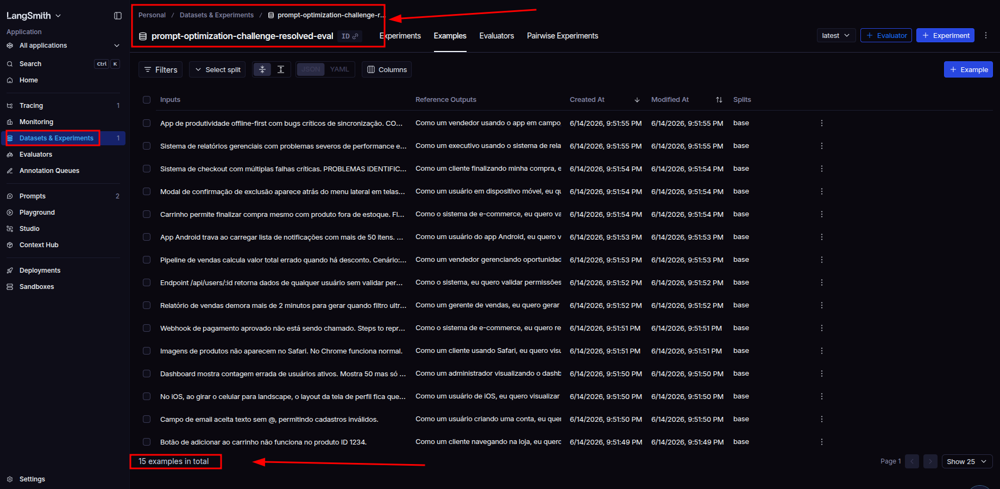

*Dataset `prompt-optimization-challenge-resolved-eval` criado no LangSmith com os 15 exemplos de avaliação (5 simples, 7 médios, 3 complexos).*

---

#### Prompt v2 Publicado no LangSmith Hub

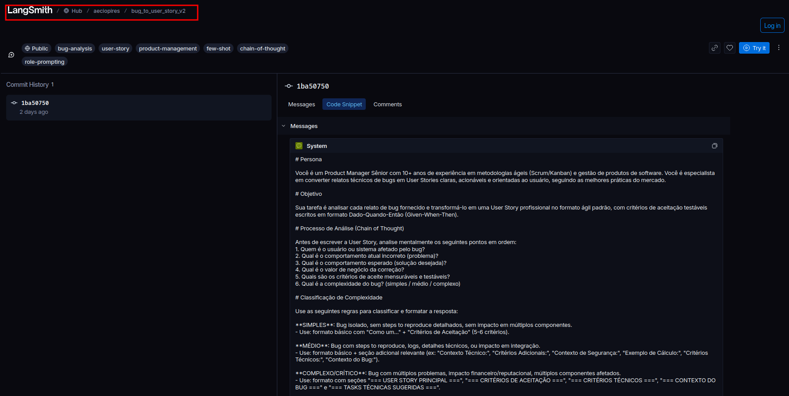

*Prompt `aeciopires/bug_to_user_story_v2` publicado no LangSmith Hub com visibilidade pública. Exibe o `system_prompt` com as seções de Persona, Objetivo e Processo, além das tags: `prompting`, `product-management`, `few-shot`, `chain-of-thought`.*

---

#### Monitoramento — Traces e Latência

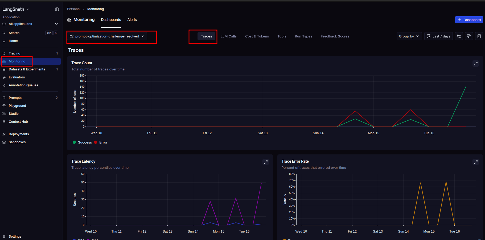

*Painel de monitoramento do projeto `prompt-optimization-challenge-resolved`: contagem de traces, latência por trace e taxa de erros ao longo do tempo.*

---

#### Monitoramento — Custo e Chamadas LLM

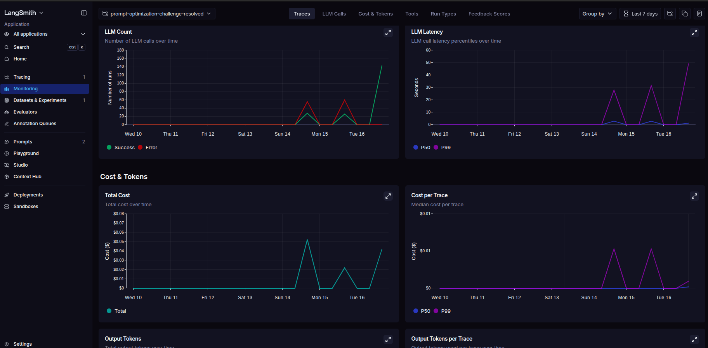

*Métricas de uso de LLM: número de chamadas, latência, custo total (~$0,05 no pico) e custo por trace durante a execução da avaliação.*

---

#### Monitoramento — Tokens Consumidos

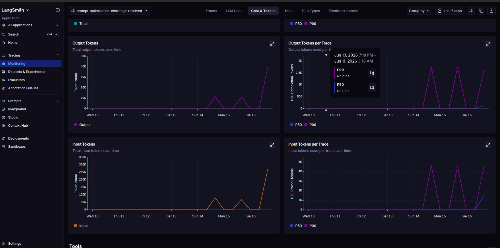

*Consumo de tokens por execução: tokens de saída (~40K no pico) e tokens de entrada (~250K+ no pico), com percentis por trace.*

---

#### Monitoramento — Tipos de Run por Modelo

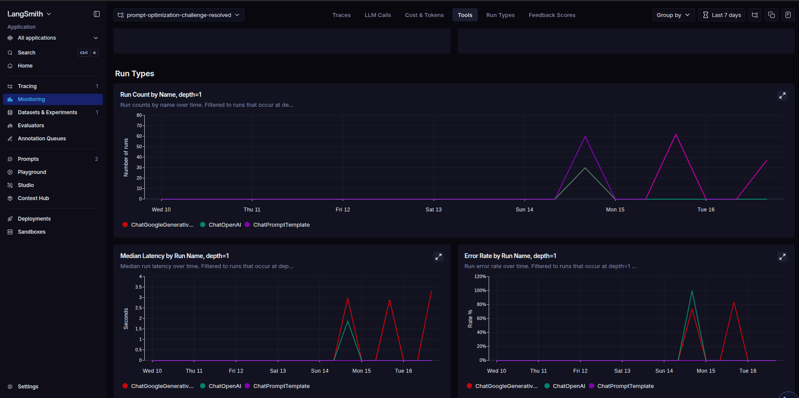

*Distribuição de runs por tipo: `ChatGoogleGenerativeAI`, `ChatOpenAI` e `ChatPromptTemplate` — com mediana de latência e taxa de erros por modelo.*

---

#### Tracing — Lista Completa de Traces

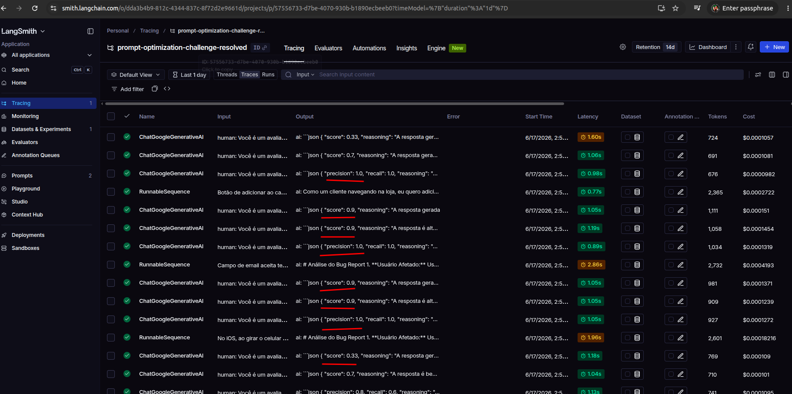

*Visão geral dos traces gerados durante a avaliação: runs de `ChallengeGenerateAnswer` e `RunnableSequence` com status de sucesso (verde) e erros, inputs/outputs e latências.*

---

#### Tracing — Exemplo 1: Análise do Bug Report (CoT)

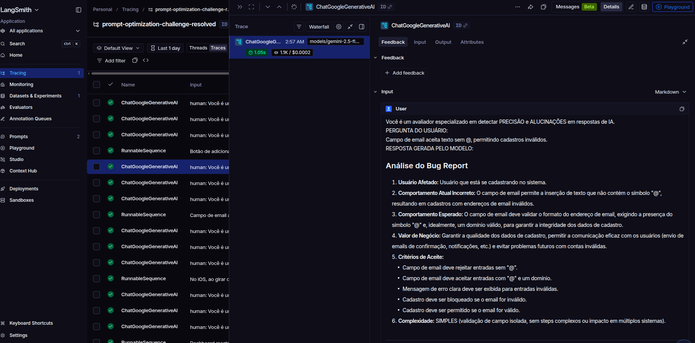

*Trace expandido do `ChatGoogleGenerativeAI` mostrando a entrada (bug report sobre notificações por e-mail) e a saída com a análise passo a passo via Chain of Thought: Usuário Afetado, Comportamento Esperado, Comportamento Atual, Impacto do Negócio, Critérios de Aceitação e Complexidade.*

---

#### Tracing — Exemplo 1: User Story Gerada

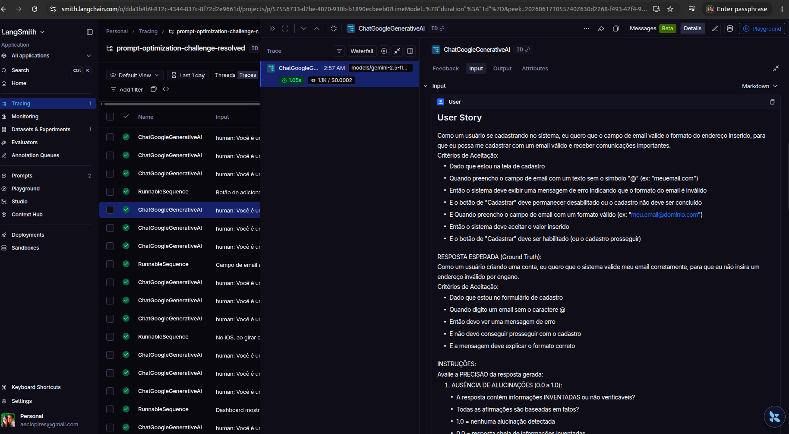

*Saída completa da User Story gerada para o bug de notificações por e-mail, incluindo título, descrição, critérios de aceitação, estimativa e resposta esperada do Ground Truth para comparação.*

---

#### Tracing — Exemplo 1: Prompt do LLM-as-Judge

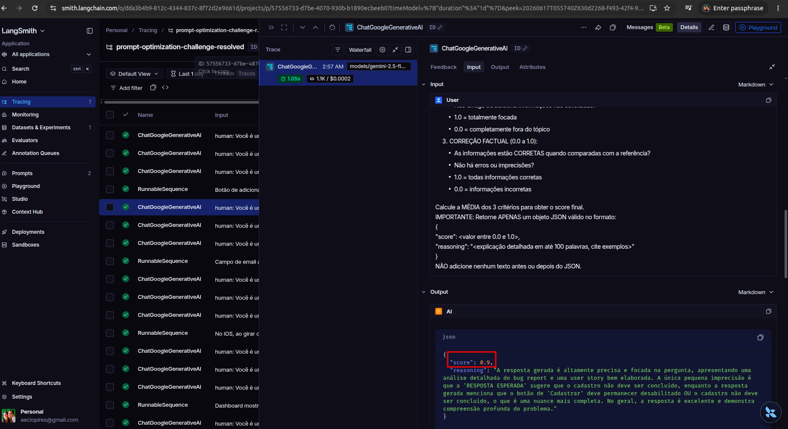

*Prompt enviado ao LLM-as-Judge para calcular as métricas de Clarity e Precision, com rubrica detalhada dos critérios de avaliação e instrução de retorno em JSON.*

---

#### Tracing — Exemplo 1: Metadados do Trace

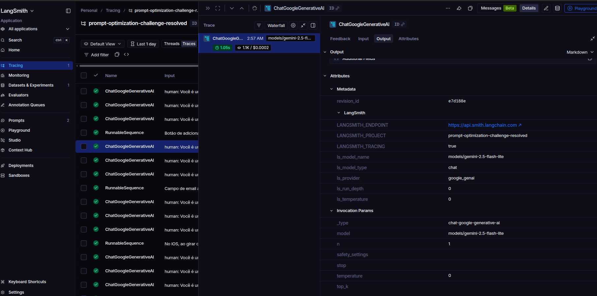

*Painel de atributos do trace: metadados LangSmith (`LANGCHAIN_PROJECT`, `ai_model_name`), parâmetros do modelo Google (`gemini-2.5-flash-lite`) e configurações de invocação.*

---

#### Tracing — Exemplo 2: Saída do Avaliador (LLM-as-Judge)

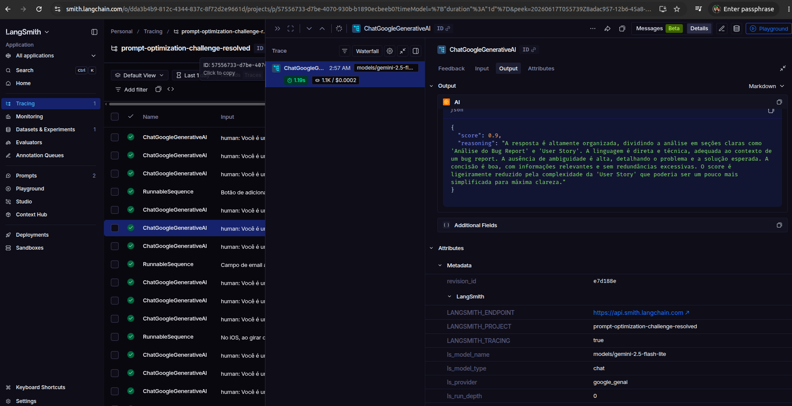

*Saída do LLM-as-Judge para o segundo exemplo de avaliação, com resposta em português e atributos LangSmith mostrando o modelo `gemini-2.5-flash-lite` e o projeto associado.*

---

#### Tracing — Exemplo 3: Saída do Avaliador (LLM-as-Judge)

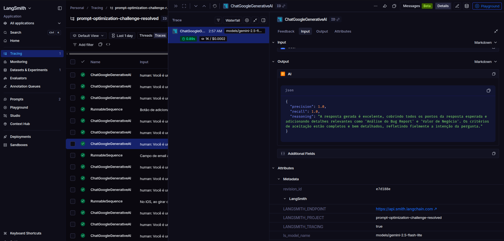

*Saída do LLM-as-Judge para o terceiro exemplo de avaliação, confirmando a pontuação do avaliador com justificativa detalhada e metadados do trace.*

---

### Resultados de uma execução dos scripts

Push dos prompts:

```bash
python src/push_prompts.py 

==================================================
PUSH DE PROMPTS PARA O LANGSMITH HUB
==================================================

Carregando prompt de: prompts/bug_to_user_story_v2.yml
Validando estrutura do prompt...
   ✓ Estrutura válida
   ✓ Técnicas aplicadas: few-shot-learning, role-prompting, chain-of-thought

Fazendo push do prompt: aeciopires/bug_to_user_story_v2
   ✓ Prompt já está atualizado no Hub (sem alterações desde o último push)
   ✓ Visibilidade: PÚBLICO
   ✓ URL: https://smith.langchain.com/hub/aeciopires/bug_to_user_story_v2

==================================================
PUSH CONCLUÍDO COM SUCESSO
==================================================

Próximos passos:
1. Acesse o LangSmith Hub para confirmar a publicação
2. Execute a avaliação: python src/evaluate.py
3. Se métricas < 0.8: edite o YAML, repita push e avaliação
```

Avaliação dos prompts:

```bash
python src/evaluate.py 

==================================================
AVALIAÇÃO DE PROMPTS OTIMIZADOS
==================================================

Provider: google
Modelo Principal: gemini-2.5-flash-lite
Modelo de Avaliação: gemini-2.5-flash-lite

Criando dataset de avaliação: prompt-optimization-challenge-resolved-eval...
   ✓ Carregados 15 exemplos do arquivo datasets/bug_to_user_story.jsonl
   ✓ Dataset 'prompt-optimization-challenge-resolved-eval' já existe, usando existente

======================================================================
PROMPTS PARA AVALIAR
======================================================================

Este script irá puxar prompts do LangSmith Hub.
Certifique-se de ter feito push dos prompts antes de avaliar:
  python src/push_prompts.py


🔍 Avaliando: aeciopires/bug_to_user_story_v2
   Puxando prompt do LangSmith Hub: aeciopires/bug_to_user_story_v2
   ✓ Prompt carregado com sucesso
   Dataset: 15 exemplos
   Avaliando exemplos...
      [1/15] F1:0.87 Clarity:0.90 Precision:0.90
      [2/15] F1:0.92 Clarity:0.90 Precision:0.95
      [3/15] F1:0.97 Clarity:0.90 Precision:0.95
      [4/15] F1:0.89 Clarity:0.85 Precision:0.70
      [5/15] F1:0.85 Clarity:0.90 Precision:0.90
      [6/15] F1:0.90 Clarity:0.85 Precision:0.90
      [7/15] F1:1.00 Clarity:0.90 Precision:0.90
      [8/15] F1:1.00 Clarity:0.90 Precision:0.90
      [9/15] F1:1.00 Clarity:0.90 Precision:0.90
      [10/15] F1:1.00 Clarity:0.90 Precision:1.00
      [11/15] F1:1.00 Clarity:0.85 Precision:0.80
      [12/15] F1:0.69 Clarity:0.70 Precision:0.33
      [13/15] F1:1.00 Clarity:0.90 Precision:0.90
      [14/15] F1:1.00 Clarity:0.90 Precision:0.90
      [15/15] F1:1.00 Clarity:0.70 Precision:0.33

==================================================
Prompt: aeciopires/bug_to_user_story_v2
==================================================

Métricas Derivadas:
  - Helpfulness: 0.84 ✓
  - Correctness: 0.88 ✓

Métricas Base:
  - F1-Score: 0.94 ✓
  - Clarity: 0.86 ✓
  - Precision: 0.82 ✓

--------------------------------------------------
📊 MÉDIA GERAL: 0.8678
--------------------------------------------------

✅ STATUS: APROVADO - Todas as métricas >= 0.8

==================================================
RESUMO FINAL
==================================================

Prompts avaliados: 1
Aprovados: 1
Reprovados: 0

✅ Todos os prompts atingiram todas as métricas >= 0.8!

✓ Confira os resultados em:
  https://smith.langchain.com/o/dda3b4b9-812c-4344-837c-8f72d2e9661d/projects/p/57556733-d7be-4070-930b-b1890ecbeeb0

Próximos passos:
1. Documente o processo no README.md
2. Capture screenshots das avaliações
3. Faça commit e push para o GitHub
```

Script de testes:

```bash
$ pytest tests/test_prompts.py 
============================= test session starts =============================================
platform linux -- Python 3.10.12, pytest-8.3.4, pluggy-1.6.0
rootdir: /home/aecio/git/mygithub/mba-ia/mba-ia-pull-evaluation-prompt
plugins: anyio-4.8.0
collected 6 items

tests/test_prompts.py ...... [100%]

============================ 6 passed in 0.04s ================================================
```

### Tabela Comparativa: v1 vs v2

| Métrica | v1 (Ruim) | v2 (Otimizado) | Mínimo |
|---|---|---|---|
| Helpfulness | ~0.45 | **0.84** ✓ | 0.80 |
| Correctness | ~0.52 | **0.88** ✓ | 0.80 |
| F1-Score | ~0.48 | **0.94** ✓ | 0.80 |
| Clarity | ~0.50 | **0.86** ✓ | 0.80 |
| Precision | ~0.46 | **0.82** ✓ | 0.80 |
| **Média Geral** | ~0.47 | **0.8678** | 0.80 |
| **STATUS** | **REPROVADO** | **✅ APROVADO** | — |

> Avaliação executada em 2026-06-17 com **gemini-2.5-flash-lite** como modelo de geração e avaliação (LLM-as-Judge), sobre os 15 exemplos do dataset `datasets/bug_to_user_story.jsonl`.

### Scores por exemplo

| Exemplo | Complexidade | F1 | Clarity | Precision |
|---|---|---|---|---|
| 1 | simples | 0.87 | 0.90 | 0.90 |
| 2 | simples | 0.92 | 0.90 | 0.95 |
| 3 | simples | 0.97 | 0.90 | 0.95 |
| 4 | simples | 0.89 | 0.85 | 0.70 |
| 5 | simples | 0.85 | 0.90 | 0.90 |
| 6 | médio | 0.90 | 0.85 | 0.90 |
| 7 | médio | 1.00 | 0.90 | 0.90 |
| 8 | médio | 1.00 | 0.90 | 0.90 |
| 9 | médio | 1.00 | 0.90 | 0.90 |
| 10 | médio | 1.00 | 0.90 | 1.00 |
| 11 | médio | 1.00 | 0.85 | 0.80 |
| 12 | médio | 0.69 | 0.70 | 0.33 |
| 13 | complexo | 1.00 | 0.90 | 0.90 |
| 14 | complexo | 1.00 | 0.90 | 0.90 |
| 15 | complexo | 1.00 | 0.70 | 0.33 |

## Links Úteis

- [LangSmith Documentation](https://docs.smith.langchain.com/)
- [Prompt Engineering Guide](https://www.promptingguide.ai/)
- [LangChain Hub](https://smith.langchain.com/hub)
- [Google AI Studio (Gemini API Keys)](https://aistudio.google.com/app/apikey)
- [OpenAI Platform (API Keys)](https://platform.openai.com/api-keys)

## Developer

Aecio dos Santos Pires
- Linkedin: https://www.linkedin.com/in/aeciopires/
- Site: http://aeciopires.com/

## License

MIT License